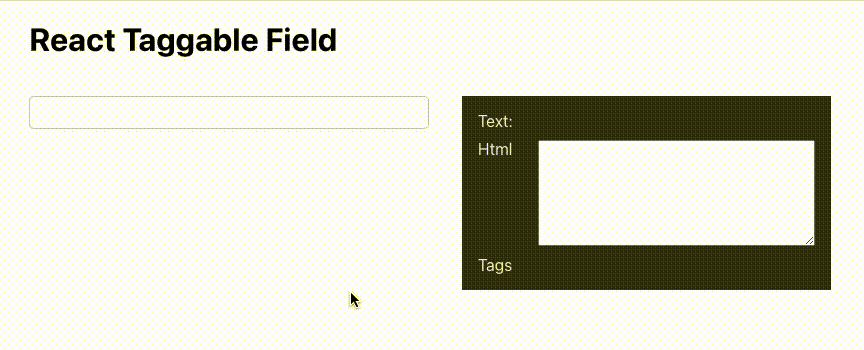

# React Taggable Field

ReactTaggableField is a react component that allows for inlining tag labels in a text input field. It supports multiple tag sets triggered by a configured character. `onChange` will return an object with text, html and inlined tags.

## Demo


### Getting started
```
npm i react-taggable-field
```
### Usage

```js
<ReactTaggableField
	autoFocus={true}
	onChange={({ text, __html, tags}) => {
		// do something with output
	}}
	tags={[{
		triggerSymbol: '#',
		highlightClass: 'thingHighlight',
		tagClass: 'thingTag',
		suggestions: [
			'amazing',
			'cool',
			'funny',
			'interesting',
			'inspiring'
		]}, {
		triggerSymbol: '@',
		highlightClass: 'peopleHighlight',
		tagClass: 'peopleTag',
		suggestions: [
			'Albert Einstein',
			'Richard Feynman',
			'Nikola Tesla'
		]}
	]}
/>
```

### Why

I wanted an input field that allows inlining multiple sets of tags triggered by any confiugured trigger character.